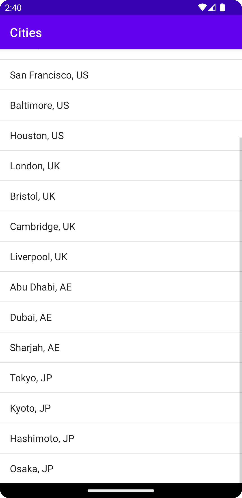
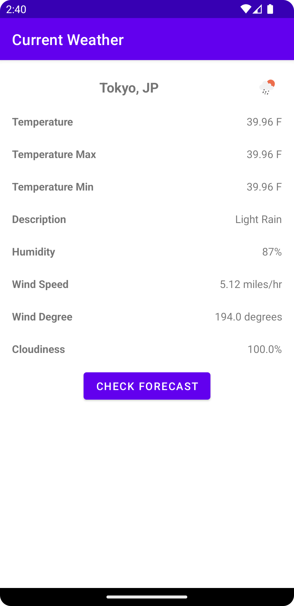
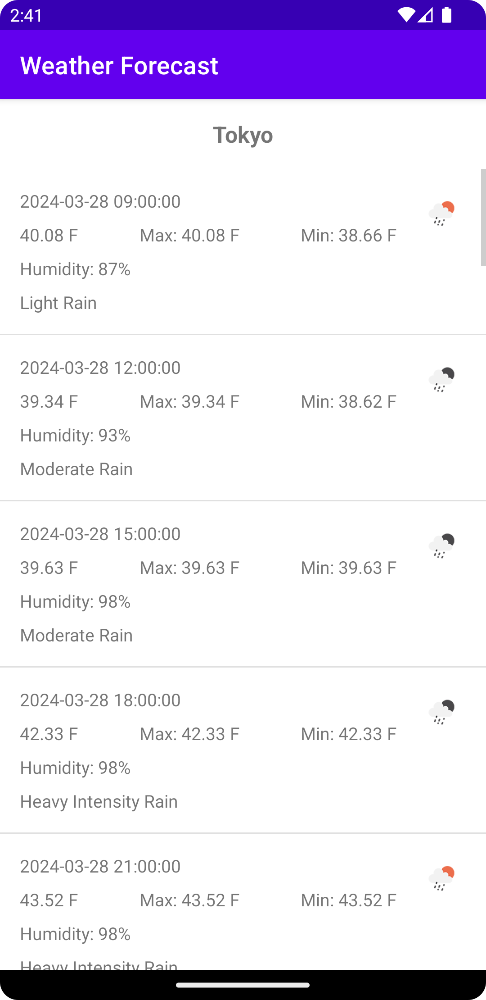

# Weather Application using OpenWeatherMap API

This is an Android application that retrieves weather information from the OpenWeatherMap API and displays it in a user-friendly interface. The application consists of three main screens: Cities List, Current Weather, and Weather Forecast.

## Features

- **Cities List Screen**: Displays a list of cities and their respective countries. Clicking on a city will navigate to the Current Weather screen for that city.

- **Current Weather Screen**: Fetches and displays the current weather information for the selected city, including temperature, humidity, wind speed, wind direction, cloudiness, and a weather icon. This screen also has a "Forecast" button that navigates to the Weather Forecast screen.

- **Weather Forecast Screen**: Retrieves and displays a 5-day weather forecast for the selected city. Each forecast item shows the date/time, weather icon, temperature, maximum temperature, minimum temperature, humidity, and weather description.

## Screenshots

<table>
    <tr>
        <td align="center">
            
             
            <em>Cities Fragment</em>
        </td>
        <td align="center">
            
             
            <em>Current Weather Fragment</em>
        </td>
        <td align="center">
            
             
            <em>Weather Forecast Fragment</em>
        </td>
    </tr>
</table>

## Getting Started

1. Sign up for an API key at [OpenWeatherMap](https://openweathermap.org/) and replace the placeholder in the code with your API key.

2. Clone or download the project repository.

3. Open the project in Android Studio.

4. Build and run the application on an emulator or physical device.

## Dependencies

This application utilizes the following third-party libraries:

- **OkHttp**: A modern HTTP client library for making API requests.
- **Picasso**: A powerful image downloading and caching library for Android.

## Documentation

- [OpenWeatherMap Current Weather API](https://openweathermap.org/current)
- [OpenWeatherMap 5 Day Weather Forecast API](https://openweathermap.org/forecast5)
- [OpenWeatherMap Weather Conditions](https://openweathermap.org/weather-conditions)
